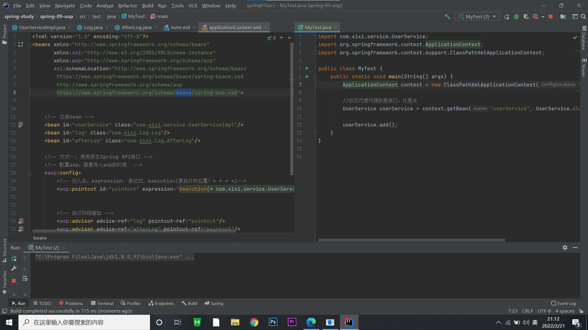
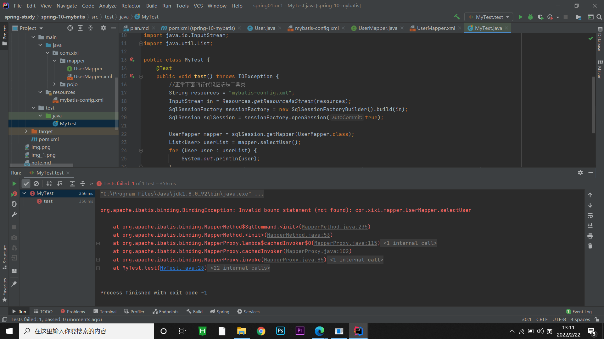
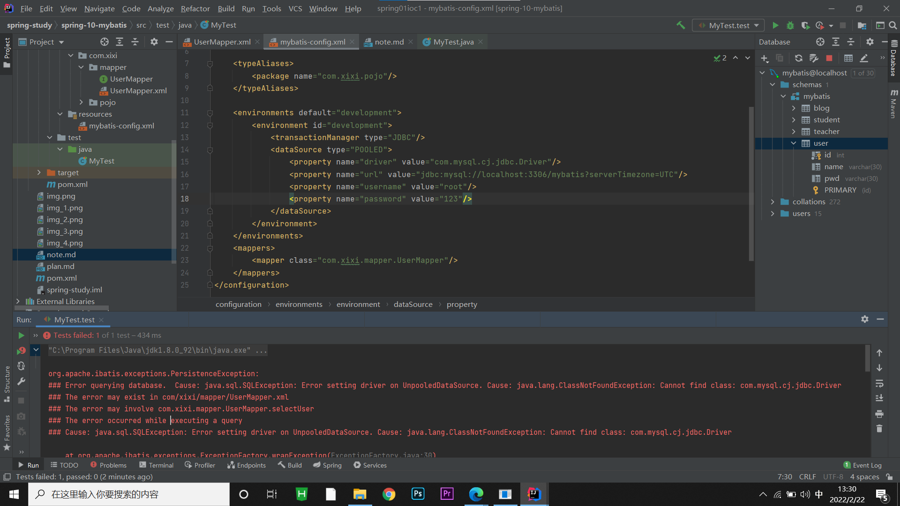
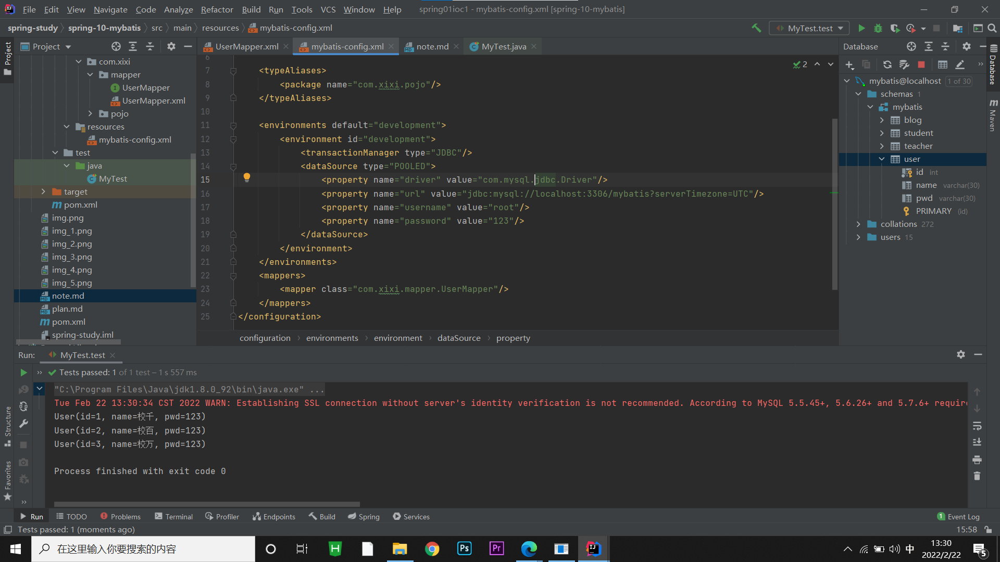
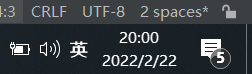

## 常用依赖
```xml
    <dependencies>
    <dependency>
        <groupId>org.springframework</groupId>
        <artifactId>spring-webmvc</artifactId>
        <version>5.2.0.RELEASE</version>
    </dependency>
    <dependency>
        <groupId>junit</groupId>
        <artifactId>junit</artifactId>
        <version>4.12</version>
    </dependency>
</dependencies>
```

## 注解说明
- @Autowired ：自动装配通过类型。名字
    如果@Autowired不能唯一自动装配上属性，则需要通过@Qualifier(value = "XXX")去配置
- @Nullable ：字段标记了这个注解，说明这个字段可以为null
- @Resource ： 自动装配通过名字。类型
- @Component : 组件，放在类上，说明这个类被Spring管理了，就是bean！

## 小结
###    xml与注解
- xml更加万能，适用于任何场合！维护简单方便
- 注解 不是自己类使用不了，维护相对复杂！

### xml与注解最佳实战
- xml用来管理bean；
- 注解只负责完成属性的注入；
- 我们在使用的过程中，只需要注意一个问题 ： 必须让注解生效，就需要开启注解的支持！
```xml
        <!-- 指定要扫描的包，这个包下的注解就会生效 -->
        <context:component-scan base-package="com.xixi.pojo"/>
        <context:annotation-config/>
```

## 静态代理
### 角色分析：

- 抽象角色：一般会使用接口或者抽象类来解决
- 真实角色：被代理的角色
- 代理角色：代理真实角色，代理真实角色后，我们一般会做一些附属操作
- 客户：访问代理对象的人！

### 步骤
- 1、接口        --------------> Rent
- 2、真实角色    --------------> Host
- 3、代理角色    --------------> Proxy
- 4、客户端访问代理角色   --------------> Client 

### 代理模式的好处
- 1、可以使真实角色的操作更加纯粹！不用去关注一些公共的业务
- 2、公共角色就交给代理角色！实现了业务的分工！
- 3、公共业务发生扩展的时候，方便集中管理！

### 代理模式的缺点
- 一个真实角色就会产生一个代理角色，代码量会翻倍，开发效率会变低~


# 出现的问题


问题：运行后，没有反应

原因：application.xml配置文件中的aop的导入路径没有写对

正确版本如下：

```xml
<?xml version="1.0" encoding="UTF-8"?>
<beans xmlns="http://www.springframework.org/schema/beans"
       xmlns:xsi="http://www.w3.org/2001/XMLSchema-instance"
       xmlns:aop="http://www.springframework.org/schema/aop"
       xsi:schemaLocation="http://www.springframework.org/schema/beans
        https://www.springframework.org/schema/beans/spring-beans.xsd
        http://www.springframework.org/schema/aop
        https://www.springframework.org/schema/aop/spring-aop.xsd">
</beans>

```

# 出现的问题


问题：org.apache.ibatis.binding.BindingException: Invalid bound statement (not found): com.xixi.mapper.UserMapper.selectUser

原因：

解决办法：在pom.xml(maven)里面加一个配置
```xml
        <build>
    <resources>
        <resource>
            <directory>src/main/java</directory>
            <includes>
                <include>**/*.xml</include>
            </includes>
            <filtering>true</filtering>
        </resource>
    </resources>
</build>
```

# 问题
问题：com.mysql.cj.jdbc.Driver 会找不到class，然后会报错
     com.mysql.jdbc.Driver  不报错，但会有警告！！！ 




解决办法


## 结束学习



# 事务管理略